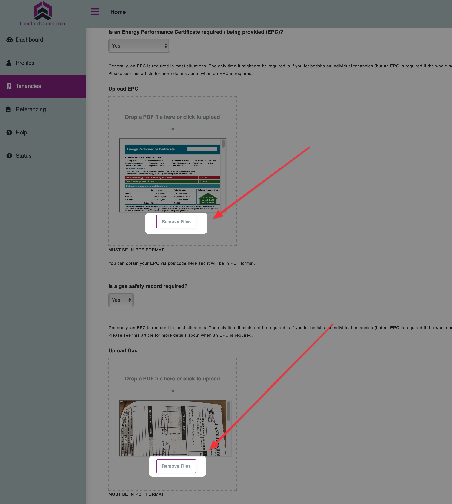

# Agreement Failed (or Hangs In Progress)

Whilst the agreement is building, you can see progress in the tenancies list on the right. It starts with an orange "in progress" indicator and will change to a green "completed" when it's done and ready for [download](../download-an-agreement.md) or [digital signing](../digital-signing-1.md).

On rare occasion, the progress indicator may show a red "failed" notification or may hang "in progress".

If this happens, the most likely cause is with one of the uploaded attachments. It might be corrupt,  password protected or some other unknown reason.

In the first instance, edit the agreement and remove all the attachment files by clicking "remove file" in each box.

Then, go the the last page and select "save and build" and submit. This will build again but without the attachments.

If this now works, we can have some confidence one of the uploaded attachments was the cause of the failure.

Next, you could start by adding the attachments one by one. To do this, go to edit, upload one of the files, save and build and then repeat the process. If it fails on any of the attachments, you know that's the problem and please replace with a working attachment.

If that fails, the next thing to try is duplicating the agreement (available from the same actions button menu where edit can be found). The duplicate record will appear at the top of the tenancies list where you can try building again.&#x20;

Finally, if none of those work, try adding a new agreement and if a pop-up appears offering to restore, click on restore.

It should be noted, the failure error could be caused by a 3rd party service being down in the cloud where the agreement is being built. This does happen from time to time and would cause the failure indicator to display or hang 'in progress'. In this case, try the build again in 10 or so minutes time. When we are aware of a 3rd party service being down, we update our [status page](check-status-page.md).
